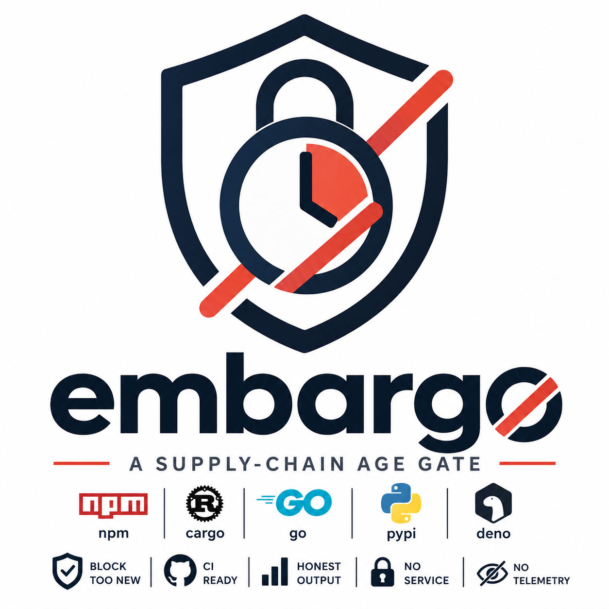

<div align="center">



# embargo

**Block dependency versions that are "too fresh."**

[](https://pkg.go.dev/github.com/sstraus/embargo)
[](https://goreportcard.com/report/github.com/sstraus/embargo)
[](https://github.com/sstraus/embargo/actions/workflows/ci.yml)
[](https://github.com/sstraus/embargo/releases)
[](LICENSE)
[](go.mod)

_A supply-chain age gate for npm, cargo, Go, PyPI and friends — no daemon, no service, no telemetry._

</div>

---

## Why

A package version published **minutes or hours ago** is the highest-risk moment in the
software supply chain. A compromised maintainer account, a malicious release, or a
typosquat is most dangerous *before* the community has had time to notice and yank it.

`embargo` enforces a **minimum release age**: a version must have existed on its registry
for at least _N_ hours before you're allowed to install or use it. It's a cheap, boring,
effective heuristic that buys the ecosystem time to catch bad releases — and buys *you*
time to not be patient zero.

```
BLOCKED  npm  shiny-new-lib@2.0.0
published 2h 46m ago — required minimum 3d
```

## What you get

- **CI gate** — scan lockfiles and fail the build on anything too young. No setup beyond a binary.
- **Install interceptor** — shims that block risky installs *before* they run (so a malicious `postinstall` never fires), for humans **and** AI coding agents.
- **Eight ecosystems** — npm, pnpm, yarn, bun, deno *(npm registry)*, cargo *(crates.io)*, go *(module proxy)*, pip / uv *(PyPI)*.
- **Honest output** — human-readable, JSON, or SARIF for GitHub code scanning.
- **Self-contained** — one static binary. No daemon, no remote service, no telemetry.

## Platform support

| Mode | macOS | Linux | Windows |
| --- | :---: | :---: | :---: |
| `embargo check` (CI gate) | ✅ | ✅ | ✅ |
| Shim / proxy / `run` (install interception) | ✅ | ✅ | ✅ |

> **Windows:** fully supported. `install-shims` writes `.cmd` and `.ps1` wrappers
> resolved via `PATHEXT`, and binary resolution honors Windows extensions, so the
> proxy intercepts `npm`, `cargo`, `go`, `pip` & co. from both `cmd.exe` and
> PowerShell. Go-ecosystem checks additionally use the local `go` toolchain when
> present, falling back to parsing `go.mod` directly.

---

## Install

**Homebrew** (macOS & Linux):

```sh
brew install sstraus/tap/embargo
```

**Go toolchain:**

```sh
go install github.com/sstraus/embargo/cmd/embargo@latest
```

Or grab a prebuilt binary from the [releases page](https://github.com/sstraus/embargo/releases).

---

## Quickstart

Scaffold a config and install the shims in one step:

```sh
embargo init
```

This writes a minimal `.embargo.yaml` (see [Configuration](#configuration)) if one is not
already present, installs the package-manager shims, and prints the PATH line to activate them.
Then scan your lockfiles:

```sh
embargo check
```

```
BLOCKED
ecosystem: npm
package: shiny-new-lib
version: 2.0.0
published: 2026-05-29T09:14:02Z
age: 2h 46m
required minimum: 3d
source: package-lock.json
reason: age 2h 46m < required minimum 3d

FAILED: 1 blocked, 12 allowed (13 checked)
```

**Exit codes:** `0` = all allowed · `1` = at least one blocked · `2` = internal or config error.

---

## CI usage

`embargo check` is useful on its own — no shims required. It emits SARIF for code scanning
and JSON for custom tooling.

```yaml
# .github/workflows/embargo.yml
name: embargo
on: [push, pull_request]
jobs:
  age-gate:
    runs-on: ubuntu-latest
    steps:
      - uses: actions/checkout@v4
      - uses: actions/setup-go@v5
        with: { go-version: stable }
      - run: go install github.com/sstraus/embargo/cmd/embargo@latest
      - run: embargo check --sarif > embargo.sarif
      - uses: github/codeql-action/upload-sarif@v3
        if: always()
        with: { sarif_file: embargo.sarif }
```

---

## Intercepting installs (humans & AI agents)

Install the shims and put them first on your PATH (`embargo init` runs `install-shims` for
you as part of setup):

```sh
embargo install-shims
export PATH="$HOME/.embargo/bin:$PATH"   # add to your shell profile
embargo doctor                            # verify it took effect
```

On Windows, add the shim directory to the front of PATH instead:

```powershell
# PowerShell
$env:PATH = "$HOME\.embargo\bin;" + $env:PATH   # add to your profile
embargo doctor
```

Now `npm install`, `pnpm add foo@1.2.3`, `cargo add`, `go get`, `pip install`, etc. are
routed through `embargo proxy`, which enforces the age policy. Where possible it blocks
**before** the real tool runs, so a malicious `postinstall` never executes:

| Command shape | Enforcement |
| --- | --- |
| `npm ci`, `npm install` (from lockfile) | **Preflight** the lockfile, block before install |
| `npm add foo@1.2.3`, `cargo add`, `go get pkg@v1.2.3` | **Preflight** the pinned spec |
| floating ranges / no lockfile yet | Run, then **re-check** the resulting lockfile |
| `npm view`, `pip list` (read-only) | Pass through untouched |

### AI coding agents

AI agents that run shell commands inherit your PATH, so the shims apply automatically once
installed. To scope it to a single session without touching your profile, launch the agent
through `run`:

```sh
embargo run -- claude        # Claude Code
embargo run -- codex         # Codex CLI
```

`run` prepends `~/.embargo/bin` to the PATH of the child process and everything it spawns.

An agent can confirm whether interception is actually active with machine-readable output:

```sh
embargo doctor --json   # {"status":"active|inactive","reason":...,"remediation":...,"tools":[...]}
```

Gate a session on it so the agent refuses to install anything while unprotected:

```sh
test "$(embargo doctor --json | jq -r .status)" = active \
  || { echo "embargo not protecting — run 'embargo init' and fix PATH"; exit 1; }
```

The `status` field is the unambiguous signal; `remediation` carries the exact command to fix an
`inactive` state.

### rtk

If you use [rtk](https://github.com/) (the Claude Code PreToolUse output-filter that
prepends `rtk` to commands), it composes cleanly: rtk is the outer wrapper, embargo's shim
is inner, and the argv shape is preserved — so embargo classifies the same command. No
configuration coupling.

---

## Configuration

`embargo` builds its effective policy by layering configs, **lowest precedence first**:

1. **Built-in defaults** — 72h minimum age, all ecosystems enforced, fail-closed.
2. **Global config** — `~/.embargo/config.yaml`, a baseline applied to every project. Handy
   when the shim/proxy intercepts commands in directories with no local config.
3. **Local config** — `.embargo.yaml` in the repo root, or the file given to `--config`.

Each layer overrides only the fields it sets, so the global config is a baseline that local
configs refine (e.g. a global `minimumReleaseAge: 120h` still applies unless a project lowers
it). `--config` replaces the *local* layer but still sits on top of the global one. Run
`embargo doctor` to see which config files are active and the effective minimum age. See
[`.embargo.example.yaml`](.embargo.example.yaml) in this repo for a fully commented example
(the same schema works as the global config).

```yaml
minimumReleaseAge: 72h
ecosystems: { npm: true, cargo: true, go: true, pip: true } # absent => all enforced
allow:
  packages: ["@company/*", "github.com/company/*"]
block:
  packages: ["evil-*", "left-pad"] # denied outright, regardless of age
remote:
  lists: ["https://raw.githubusercontent.com/company/embargo-lists/main/blocklist.yaml"]
exceptions:
  - { ecosystem: npm, package: lodash, version: 4.17.21, reason: "sec fix", expires: "2026-06-15" }
policy:
  enforceDirectDependencies: true
  enforceTransitiveDependencies: true
  failOpenOnRegistryError: false
  cacheTTL: 24h
```

### Block list and shared remote lists

`block.packages` is the mirror image of `allow.packages`: any dependency whose name matches a
block glob is denied **regardless of age**. A block beats the allowlist, so you can allow a
whole scope (`@company/*`) while still denying one compromised package within it. An explicit
`exception` still wins over a block — that's the deliberate escape hatch for an urgent fix.

`remote.lists` points embargo at **HTTPS** URLs that publish a shared allow/block list — for
example a file in a GitHub repo that several teams subscribe to. Each list is fetched, cached
on disk (using `cacheTTL`), and its `allow`/`block` packages merged into the local lists. URLs
must use `https`, and a redirect that would leave `https` is refused — a block list's integrity
is load-bearing, so the transport is never downgraded. The remote file uses the same schema,
with just the two list keys:

```yaml
# blocklist.yaml, published anywhere reachable over HTTPS
allow:
  packages: ["@trusted/*"]
block:
  packages: ["evil-pkg", "left-pad"]
```

A list entry may be a bare URL string or a `{url, required}` mapping:

```yaml
remote:
  lists:
    - https://example.com/blocklist.yaml          # optional (default)
    - url: https://example.com/critical.yaml       # required: fails closed
      required: true
```

By default, if a remote list is unreachable (network down, 404), embargo **warns and falls back
to the last cached copy**, or skips that list if it was never fetched — it never fails the run on
a remote hiccup. Mark a source `required: true` to invert that for a security-critical list: if it
yields no usable content (unreachable with no cache, or malformed) the run **fails closed** (exit
2). `--no-cache` disables the on-disk fallback and forces a fresh fetch each time.

### How a decision is made

Each dependency runs through an ordered rule chain; the first rule with a verdict wins:

1. **scope** — skip deps whose scope (direct vs. transitive) isn't being enforced.
2. **exception** — an explicit, expiring allowance for a specific version (overrides a block).
3. **blocklist** — trusted-deny package globs; a match is blocked outright.
4. **allowlist** — trusted package-name globs (does NOT override the blocklist).
5. **age gate** — allow iff `now − publishedAt ≥ minimumReleaseAge`.

### Flags

| Flag | Effect |
| --- | --- |
| `--config <path>` | Path to the policy file (default `<root>/.embargo.yaml`) |
| `--root <dir>` | Repository root to scan (default `.`) |
| `--min-age <dur>` | Override `minimumReleaseAge`, e.g. `72h` |
| `--json` | Emit JSON |
| `--sarif` | Emit SARIF 2.1.0 |
| `--fail-open` | Allow on registry errors (default: fail-closed) |
| `--no-cache` | Bypass the on-disk metadata cache |

---

## Honest limitations

PATH shims are **best-effort**, not a sandbox. They do **not** intercept:

- absolute-path invocations (`/usr/local/bin/npm install`),
- `python -m pip`, `npx` / `bunx`, `corepack`, `go run`,
- shell aliases that point straight at the real binary.

`embargo doctor` reports these coverage gaps and whether the shim directory is actually
ahead of the real tools in your PATH. For an authoritative gate, run `embargo check` in
CI — it reads lockfiles directly and doesn't depend on PATH.

Age is a heuristic, not a guarantee: it buys time for the community to detect and yank bad
releases, but it cannot vouch for a version's contents.

---

## Development

```sh
go build ./...
go test ./...
go vet ./...
```

## License

[MIT](LICENSE)
